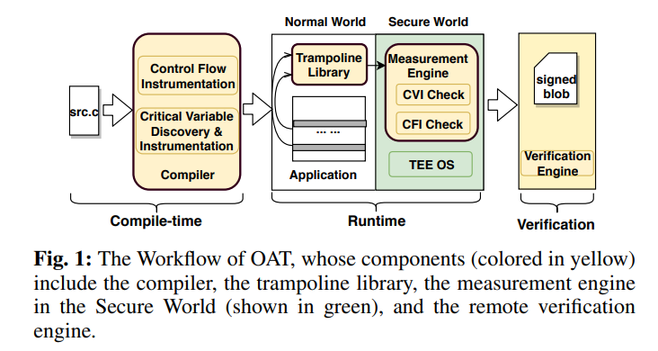

# Prototype for OAT: Attesting Operation Integrity of Embedded Devices

This repository is a prototype implementation for our paper [OAT: Attesting Operation Integrity of Embedded Devices(Oakland'20)][1]. It contains the OAT Compiler (`oat-llvm40`), the OAT Trampoline Library (`oat-trampoline-lib`), the OAT Measurement Engine (`oat-measurement-engine-ta`), the OAT Verify Engine (`oat-verify-engine`), evaluation examples (`oat-evaluation`), and a few test programs for the OAT compiler (`oat-test`). 

OAT is an end-to-end remote attestation system that allows a verifier to attest the `control-flow integrity` and `critical data integrity` of a critical operation on a prover, which is usually a remotely deployed embedded device. You can check out our conference talk [here](https://www.youtube.com/watch?v=yxS5AoyszP8). The OAT system architecture is shown as below:
 


## Contents

- `oat-llvm40`: OAT-Compiler based on llvm-4.0.0. It is used to analyze and instrument the embedded applications for critical data and control flow measurements. Modifications to the llvm front end are under `oat-llvm40/lib/Transforms/`, like `CFVHints/` and `Nova/`; modifications to the llvm back-end are under `oat-llvm40/lib/Target/AArch64/`, like `AArch64ControlFlowVerification.cpp` and `AArch64ControlFlowVerification.h`.  
- `oat-trampoline-lib`: OAT trampoline library, can be built as a shared library and linked with instrumented applications. It depends on the OP-TEE client library `libteec`.
- `oat-measurement-engine-ta`: OAT measurement engine, which is a trusted application (TA) runs inside the TEE. Build it as an OP-TEE TA.
- `oat-verify-engine`: OAT verify engine. It verifies the attestation blob with the application's binary and trace. 
- `oat-evaluation`: OAT evaluation programs, `-orig` is the unmodified version of the code, `-cb` is the modified version (annotated) ready for compilation/instrumentation.
- `oat-test`: Some test programs for the OAT compiler. Test OAT-compiler's support for instrumentation, annotation, and c++ code.

## Requirements

- Install OAT-Compiler on a server with enough memory, as recompilation of the OAT-Compiler needs large memory. (OAT-Compiler is based on LLVM-4.0.0, Server runs Ubuntu 16.04.)
- [HiKey (LeMaker version)][3](HiKey 620) with Debian OS installed.
- Install OP-TEE OS(OP-TEE 2.0) on the HiKey board. OP-TEE used to have support for Debian OS on HiKey board (with OP-TEE 2.0), now it only support AOSP. See an old issue [here][13] for more details.
- Install OP-TEE OS and TA compilation environment on the development server(or desktop), so that you can recompile the TA or TEE OS when needed, see [Tips for TA](https://optee.readthedocs.io/en/latest/building/trusted_applications.html). 
- Install a native Arm64 gcc compiler on the Hikey board to compile embedded applications locally.

## Workflow

- Prepare: Given an evaluation program, select the operation (a code piece that performs some critical functionality) you want to attest, and annotate the critical variables. 
- Trampoline Library: Build the TEE Client library and the trampoline library.
- Compile: Compile the code with the OAT-Compiler into Arm64 assembly code on the server where OAT-Compiler is installed, then compile the assembly code and link it with pre-built trampoline library on the target device (HiKey Board in our case).
- Install TA: Compile and install measurement engine as an OP-TEE TA on the HiKey Board.
- Run the evaluation program on HiKey Board. Make sure tee-supplicant is launched and TA can be called.
- Collect the attestation blob. For ease of verification, the trace of indirect branch and conditional branch are printed out to a file, which you can use for the verification.
- Verify the blob. Verify the attestation blob with the verify engine, the binary of the evaluation program is also needed.

## Note

- The evaluation programs are modified (sometimes tailored to keep the key operations for evaluation) when necessary to work in a way that it periodically perform a operation, mimicking the non-stop embedded programs deployed remotely.
- We do not sign the attestation blob for this prototype and only store them as secure objects.
- The OAT-Compiler's support for Pointer-based Access based on SoftBound is not fully functional, and is currently commented out.
- The Makefile of each directory contains rich information about how each part is compiled and used.
- The OP-TEE and LLVM repo that we base on are a bit old as this project started early. Another way to use this repo is to port the code to newer version.


## Credits: 

- This project is inspired by [C-FLAT][2] and [SoftBound][8].
- The taint analysis and points-to analysis used in OAT-Compiler is benefited from the [DR.CHECKER paper][12]
- [BLAKE2][9] cryptographic hash function. Inherited the ported
  the version of [reference implementation of BLAKE2s][10] from [C-FLAT][2]. 
- Verification engine is based on "The Ultimate Disassembler" [Capstone Engine][11].
- Evaluation programs are from github: [alarm4pi][4], [light-controller][5], [rc][6], [roverpi][7].

## Issues
If you encounter any problem while using our tool, please open an issue. 

For other communications, you can email sun.zhi [at] northeastern.edu.


## Citing our [paper](https://arxiv.org/pdf/1802.03462.pdf)
```bibtex
@inproceedings{sun2020oat,
  title={OAT: Attesting operation integrity of embedded devices},
  author={Sun, Zhichuang and Feng, Bo and Lu, Long and Jha, Somesh},
  booktitle={2020 IEEE Symposium on Security and Privacy (SP)},
  pages={1433--1449},
  year={2020},
  organization={IEEE}
}
```

## Disclaimer

All implementations are only research prototypes!

Our code is NOT safe for production use! Please use it only for tests.

## License

Licensed under the Apache License, Version 2.0 (the "License");
you may not use this file except in compliance with the License.
You may obtain a copy of the License at

[http://www.apache.org/licenses/LICENSE-2.0](http://www.apache.org/licenses/LICENSE-2.0)

Unless required by applicable law or agreed to in writing, software
distributed under the License is distributed on an "AS IS" BASIS,
WITHOUT WARRANTIES OR CONDITIONS OF ANY KIND, either express or implied.
See the License for the specific language governing permissions and
limitations under the License.

[1]: https://arxiv.org/pdf/1802.03462.pdf "OAT: Attesting Operation Integrity of Embedded Devices"
[2]: https://arxiv.org/abs/1605.07763 "C-FLAT: Control-FLow ATtestation for Embedded Systems Software"
[3]: https://www.96boards.org/product/hikey/ "HiKey Board"
[4]: https://github.com/ddrazir/alarm4pi "alarm4pi"
[5]: https://github.com/Barro/light-controller "light-controller" 
[6]: https://github.com/bskari/pi-rc/tree/pi2 "rc"
[7]: https://github.com/Gwaltrip/RoverPi/tree/master/tcpRover "roverpi"
[8]: http://acg.cis.upenn.edu/papers/pldi09_softbound.pdf "SoftBound"
[9]: https://blake2.net/ "BLAKE2 — fast secure hashing"
[10]: https://github.com/BLAKE2/BLAKE2 "BLAKE2/BLAKE2: BLAKE2 official implementations"
[11]: http://www.capstone-engine.org/ "Capstone Engine"
[12]: https://www.usenix.org/system/files/conference/usenixsecurity17/sec17-machiry.pdf "DR.CHECKER"
[13]: https://github.com/OP-TEE/optee_os/issues/1257 "OP-TEE with Debian OS on Hikey Board"
